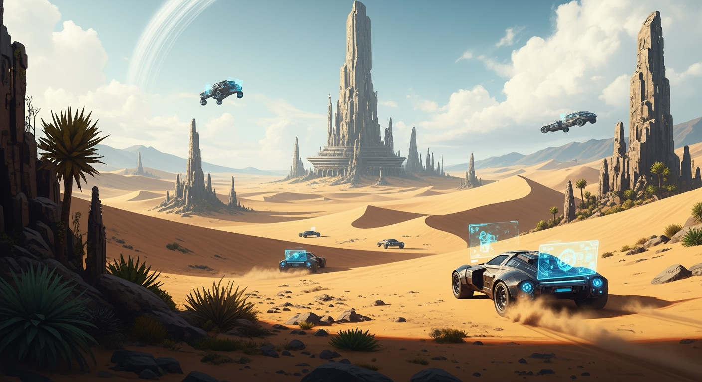

# Vibe Worldbuilding MCP

> **Create detailed fictional worlds with Claude** - Complete with automatic taxonomies, interconnected entries, AI-generated images, and navigable websites.



## ⚡ Quick Start

### Option A: Automated Setup (Recommended)
```bash
# Run the setup script - handles everything automatically
python3 scripts/setup.py
```

### Option B: Manual Setup
```bash
# Create virtual environment (recommended)
python3 -m venv venv
source venv/bin/activate  # On Windows: venv\Scripts\activate

# Install Python dependencies
pip install -e .

# Node.js dependencies (for website generation)  
npm install
```

**Why use a virtual environment?**
- Isolates project dependencies from system Python
- Prevents conflicts with other Python projects
- Ensures consistent dependency versions
- Required for proper MCP server functionality

### 2. Configure FAL API (Optional - for image generation)
```bash
# Add your FAL API key to .env
echo "FAL_KEY=your_api_key_here" > .env
```

### 3. Development Ready
Your MCP server is now ready for development and testing:

```bash
# Activate virtual environment
source venv/bin/activate

# Test the server manually
python vibe_worldbuilding_server.py

# Or integrate with custom MCP clients
# (web interfaces, Claude Code, etc.)
```

### 4. Create Your First World
```
1. Ask Claude: "Create a fantasy world about floating islands"
2. Claude uses MCP tools to build complete world structure
3. Generated world includes entries, images, and navigable website
```

## 🔧 Troubleshooting

### MCP Server Issues

**Tool execution hangs or fails:**
```bash
# Check if virtual environment is activated
source venv/bin/activate

# Verify all dependencies are installed
pip install -e .

# Test dependencies
python -c "import requests, mcp; print('Dependencies OK')"
```

**Missing Dependencies:**
- **requests**: Required for FAL API image generation
- **mcp**: Required for MCP server functionality  
- Use virtual environment to avoid conflicts with system packages

**Permission Issues:**
- Ensure MCP server has write access to output directory
- Check that Python path in Claude Desktop config is correct

## 🌟 What You Get

**Complete Worldbuilding Pipeline:**
- ✅ **Rich world concepts** with detailed lore and atmosphere
- ✅ **Custom taxonomies** (characters, locations, artifacts, etc.)
- ✅ **Interconnected entries** with automatic cross-references
- ✅ **AI-generated images** for visual world elements
- ✅ **Static websites** with navigation and image galleries
- ✅ **Auto-stub generation** for referenced entities

## 📚 Documentation

| Document | Purpose |
|----------|---------|
| **[📖 User Guide](docs/README.md)** | Complete usage documentation and examples |
| **[⚡ Workflow Guide](docs/WORKFLOW.md)** | MCP command sequence and best practices |
| **[🔧 Development Guide](docs/DEVELOPMENT.md)** | Contributing and development setup |
| **[🏗️ Architecture Guide](docs/ARCHITECTURE.md)** | System design and technical details |

## 🧪 Testing

```bash
# Run complete test suite
python tests/run_tests.py

# Test with image generation
python tests/test_e2e_comprehensive.py --verbose

# Keep test world for exploration
python tests/test_e2e_comprehensive.py --verbose
```

## 🚀 Example Worlds

- **[Verdant Realms](example-worlds/)** - Bioluminescent forest ecosystem
- **[Test Worlds](test-worlds/)** - Generated by test suite

## 📄 License

MIT License - See [LICENSE](LICENSE) for details.

---

**Made with Claude** 🤖 | **Powered by MCP** ⚡ | **Enhanced with AI Images** 🎨